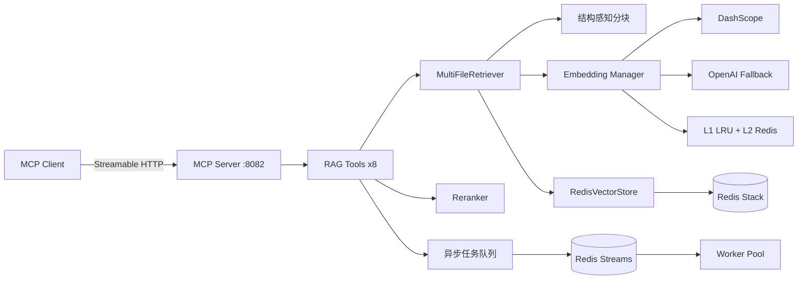

# RAG MCP Server

基于 Redis Stack（RediSearch + Vector）的 **RAG（检索增强生成）MCP Server**，通过 [Model Context Protocol](https://modelcontextprotocol.io/) 为 AI 应用提供文档索引、语义检索、Rerank 精排和 RAG Prompt 构建能力。

## 架构概览



**核心能力：**

- 文档分块（Markdown 结构感知 / 通用文本 / HTML / PDF）
- 向量索引（FLAT / HNSW 算法，自动 Schema 版本化迁移）
- 语义检索 + 混合检索（BM25 全文 + 向量）
- Rerank 精排（DashScope qwen3-rerank / gte-rerank-v2）
- RAG Prompt 自动构建（多文件分组上下文）
- 异步索引（Redis Streams 分布式任务队列）
- 多 Embedding Provider 故障转移 + 熔断 + 负载均衡
- Redis Sentinel / Cluster 高可用支持

---

## 环境准备

### 1. Go 环境

需要 **Go 1.24+**：

```bash
go version
# go version go1.24.x ...
```

### 2. Redis Stack

服务器需要 Redis 并加载 **RediSearch** 模块（用于向量索引和全文检索）。推荐使用 Docker：

```bash
# 一键启动 Redis Stack（包含 RediSearch + RedisJSON）
docker run -d --name redis-stack \
  -p 6379:6379 \
  -e REDIS_ARGS="--requirepass 123456" \
  redis/redis-stack:latest
```

验证 RediSearch 模块已加载：

```bash
redis-cli -a 123456 MODULE LIST
# 输出应包含 "search" 模块
```

### 3. Embedding API Key

至少需要一个 Embedding 服务的 API Key。默认配置使用阿里云 DashScope：

| Provider | 模型 | 维度 | 获取方式 |
|----------|------|------|----------|
| DashScope | text-embedding-v4 | 1024 | [阿里云百炼](https://dashscope.console.aliyun.com/) |
| OpenAI | text-embedding-3-small | 1536 | [OpenAI Platform](https://platform.openai.com/) |

### 4. 环境变量

`config.toml` 中 `${VAR_NAME}` 语法的值会自动替换为环境变量。复制 `.env.example` 为 `.env` 并填写实际值：

```bash
cp .env.example .env
```

各功能模块的环境变量分组如下（完整列表见 `.env.example`）：

| 分组 | 环境变量 | 说明 |
|------|----------|------|
| Redis | `REDIS_PASSWORD` | Redis 密码 |
| Embedding (主) | `EMBEDDING_PRIMARY_BASE_URL` / `_API_KEY` / `_MODEL` | 主 Embedding 服务 |
| Embedding (备) | `EMBEDDING_FALLBACK_BASE_URL` / `_API_KEY` / `_MODEL` | 备用 Embedding 服务 |
| Rerank | `RERANK_BASE_URL` / `_API_KEY` / `_MODEL` | 重排序服务 |
| HyDE | `HYDE_BASE_URL` / `_API_KEY` / `_MODEL` | 查询扩展 |
| Multi-Query | `MULTI_QUERY_BASE_URL` / `_API_KEY` / `_MODEL` | 多查询检索 |
| Compressor | `COMPRESSOR_BASE_URL` / `_API_KEY` / `_MODEL` | 上下文压缩 |
| Graph RAG | `GRAPH_NEO4J_PASSWORD` | Neo4j 密码 |
| Graph RAG LLM | `GRAPH_LLM_BASE_URL` / `_API_KEY` / `_MODEL` | 实体提取器 |
| Milvus | `MILVUS_TOKEN` | Milvus Cloud Token |
| Qdrant | `QDRANT_API_KEY` | Qdrant Cloud API Key |

---

## 快速启动

### 1. 编译

```bash
cd mcp_rag_server
go build -o rag-mcp-server .
```

### 2. 配置

编辑 `config.toml`，核心配置项：

```toml
[server]
port = 8082
instance_id = "node-1"        # 多实例部署时每个节点唯一

[redis]
mode = "standalone"            # standalone / sentinel / cluster
addr = "localhost:6379"
password = "123456"

[retriever]
index_algorithm = "FLAT"       # FLAT（<100万向量）或 HNSW（大规模）
hybrid_search_enabled = false  # 开启混合检索（BM25 + 向量）

[rerank]
enabled = true                 # 启用 Rerank 精排
provider = "dashscope"
model = "qwen3-rerank"
api_key = "sk-xxx"

[async_index]
enabled = false                # 启用异步索引（Redis Streams 任务队列）
worker_count = 3
```

**Redis 三种模式：**

```toml
# Standalone（默认，单节点）
[redis]
mode = "standalone"
addr = "localhost:6379"

# Sentinel（高可用主从）
[redis]
mode = "sentinel"
addrs = ["sentinel1:26379", "sentinel2:26379", "sentinel3:26379"]
master_name = "mymaster"

# Cluster（分片集群，注意 retriever 需使用 Hash Tag 模板）
[redis]
mode = "cluster"
addrs = ["node1:6379", "node2:6379", "node3:6379"]
# 同时修改 retriever 模板：
# [retriever]
# user_index_name_template = "mcp_rag_{user_%d}:idx"
# user_index_prefix_template = "mcp_rag_{user_%d}:"
```

### 3. 启动

```bash
./rag-mcp-server -config config.toml
```

输出示例：

```
INFO  配置加载成功: rag-mcp-server v2.0.0 (port: 8082, instance: node-1)
INFO  Redis 连接成功 (mode=standalone)
INFO  Embedding 管理器已初始化: 1 个 Provider
INFO  索引算法: FLAT | 混合检索: false | 结构感知分块: true | Rerank: true | 异步索引: false
INFO  RAG MCP Server 已启动: http://localhost:8082/mcp
```

服务端点：`http://localhost:8082/mcp`（Streamable HTTP）

---

## 测试

测试文件位于 `tests/` 目录，分为**纯单元测试**和**集成测试**两层。

### 单元测试（无外部依赖）

这些测试不需要 Redis 或 Embedding API，可在任何环境直接运行：

```bash
cd mcp_rag_server
go test -short -v ./tests/
```

覆盖范围：

| 测试文件 | 测试内容 |
|----------|----------|
| `config_test.go` | 默认配置值、错误码注册、RecallTopK 计算 |
| `errors_test.go` | RAGError 创建、Unwrap、错误码匹配 |
| `parser_test.go` | Markdown/HTML/Text 文档解析、结构感知分块 |
| `cache_test.go` | LRU 缓存 Put/Get/Eviction/TTL/Batch/Stats |
| `embedding_manager_test.go` | Manager 配置默认值 |

### 集成测试（需要 Redis + Embedding API）

集成测试需要运行中的 Redis Stack 和有效的 Embedding API Key：

```bash
# 确保 Redis 在 localhost:6379 运行（密码 123456）
# 确保 DashScope API Key 有效

cd mcp_rag_server

# 运行所有集成测试
go test -v -run TestIntegration ./tests/

# 运行单个测试
go test -v -run TestIntegration_IndexAndSearch_SmallFile ./tests/
go test -v -run TestIntegration_MultiFile_CrossSearch ./tests/
go test -v -run TestIntegration_Rerank_EndToEnd ./tests/
```

集成测试覆盖：

| 测试 | 说明 |
|------|------|
| `TestIntegration_IndexAndSearch_SmallFile` | 小文件索引 + 检索验证 |
| `TestIntegration_IndexAndSearch_LargeFile` | 大文件多 chunk 索引 + 多查询验证 |
| `TestIntegration_MultiFile_CrossSearch` | 多文件跨文档检索 + 文件过滤 + Prompt 构建 |
| `TestIntegration_IndexResult_JSON` | 索引结果序列化验证 |
| `TestIntegration_Rerank_EndToEnd` | 向量检索 -> Rerank 精排全流程对比 |

### Rerank 专项测试

```bash
go test -v -run TestReranker ./tests/
```

### 运行全部测试

```bash
cd mcp_rag_server

# 仅单元测试
go test -short ./tests/

# 全部测试（需要 Redis + API）
go test -v ./tests/

# 带覆盖率
go test -v -cover ./tests/ ./rag/ ./tools/
```

### 测试数据

`testdata/` 目录包含测试文档：

```
testdata/
├── small_intro.txt              # 小文件（单 chunk）
├── golang_concurrency.md        # Go 并发编程（中等大小）
├── distributed_systems.md       # 分布式系统（大文件，多 chunk）
├── kubernetes_guide.md          # Kubernetes 指南
├── cloud_native_architecture.md # 云原生架构
├── redis_vector_search.md       # Redis 向量搜索
└── GitNexus—代码知识图谱.md       # 中文文档测试
```

---

## curl 接口测试

MCP 使用 JSON-RPC 2.0 协议。以下 curl 用例可直接复制运行，用于验证所有工具是否正常工作。

> **提示：** Windows CMD 不支持单引号，请在 **PowerShell**（使用 `curl.exe`）或 **Git Bash** 中运行。

### Step 0: 初始化会话

所有工具调用前需先初始化 MCP 会话，获取 `Mcp-Session-Id`：

```bash
curl -s -X POST http://localhost:8082/mcp \
  -H "Content-Type: application/json" \
  -H "Accept: application/json, text/event-stream" \
  -d '{
    "jsonrpc": "2.0",
    "id": 0,
    "method": "initialize",
    "params": {
      "protocolVersion": "2025-03-26",
      "capabilities": {},
      "clientInfo": { "name": "curl-test", "version": "1.0.0" }
    }
  }' -D - -o /dev/null 2>&1 | grep -i "mcp-session-id"
```

记下响应头中的 `Mcp-Session-Id` 值，后续所有请求替换 `<SESSION_ID>`。

> 用 jq 提取业务结果：在任意 curl 末尾追加 `| jq '.result.content[0].text | fromjson'`

### Test 1: rag_index_document（同步索引）

```bash
curl -s -X POST http://localhost:8082/mcp \
  -H "Content-Type: application/json" \
  -H "Accept: application/json, text/event-stream" \
  -H "Mcp-Session-Id: <SESSION_ID>" \
  -d '{
    "jsonrpc": "2.0",
    "id": 1,
    "method": "tools/call",
    "params": {
      "name": "rag_index_document",
      "arguments": {
        "content": "# Go 并发编程\n\nGo 通过 goroutine 实现轻量级并发。goroutine 的创建成本极低，一个 goroutine 只需约 2KB 的栈空间。\n\n## Channel\n\nChannel 是 goroutine 之间通信的管道，遵循 CSP 并发模型。\n\n## Select\n\nselect 语句让 goroutine 同时等待多个 channel 操作。",
        "file_id": "go-concurrency-001",
        "user_id": 1,
        "file_name": "golang_concurrency.md",
        "format": "markdown"
      }
    }
  }' | jq '.result.content[0].text | fromjson'
```

预期返回：

```json
{
  "file_id": "go-concurrency-001",
  "file_name": "golang_concurrency.md",
  "total_chunks": 1,
  "indexed": 1,
  "failed": 0,
  "format": "markdown"
}
```

### Test 2: rag_index_document（异步索引）

> 需要 `config.toml` 中 `[async_index] enabled = true`

```bash
curl -s -X POST http://localhost:8082/mcp \
  -H "Content-Type: application/json" \
  -H "Accept: application/json, text/event-stream" \
  -H "Mcp-Session-Id: <SESSION_ID>" \
  -d '{
    "jsonrpc": "2.0",
    "id": 2,
    "method": "tools/call",
    "params": {
      "name": "rag_index_document",
      "arguments": {
        "content": "# Kubernetes 基础\n\nKubernetes（K8s）是开源的容器编排平台。Pod 是 K8s 中最小的部署单元，一个 Pod 可以包含一个或多个容器。\n\n## Deployment\n\nDeployment 管理 Pod 的副本数和滚动更新策略。\n\n## Service\n\nService 为一组 Pod 提供稳定的网络端点和负载均衡。",
        "file_id": "k8s-basics-001",
        "user_id": 1,
        "file_name": "kubernetes_basics.md",
        "format": "markdown",
        "async": true
      }
    }
  }' | jq '.result.content[0].text | fromjson'
```

预期返回：

```json
{
  "task_id": "xxxxxxxx-xxxx-xxxx-xxxx-xxxxxxxxxxxx",
  "status": "pending",
  "message": "Document indexing submitted. Use rag_task_status to check progress."
}
```

### Test 3: rag_task_status（查询异步任务）

> 将 `<TASK_ID>` 替换为 Test 2 返回的 `task_id`

```bash
curl -s -X POST http://localhost:8082/mcp \
  -H "Content-Type: application/json" \
  -H "Accept: application/json, text/event-stream" \
  -H "Mcp-Session-Id: <SESSION_ID>" \
  -d '{
    "jsonrpc": "2.0",
    "id": 3,
    "method": "tools/call",
    "params": {
      "name": "rag_task_status",
      "arguments": {
        "task_id": "<TASK_ID>"
      }
    }
  }' | jq '.result.content[0].text | fromjson'
```

预期返回：

```json
{
  "task_id": "xxxxxxxx-xxxx-xxxx-xxxx-xxxxxxxxxxxx",
  "user_id": 1,
  "file_id": "k8s-basics-001",
  "file_name": "kubernetes_basics.md",
  "status": "completed",
  "created_at": "2026-03-12T10:00:00+08:00",
  "updated_at": "2026-03-12T10:00:01+08:00",
  "result": {
    "file_id": "k8s-basics-001",
    "file_name": "kubernetes_basics.md",
    "total_chunks": 1,
    "indexed": 1,
    "failed": 0
  }
}
```

### Test 4: rag_search（语义检索）

```bash
curl -s -X POST http://localhost:8082/mcp \
  -H "Content-Type: application/json" \
  -H "Accept: application/json, text/event-stream" \
  -H "Mcp-Session-Id: <SESSION_ID>" \
  -d '{
    "jsonrpc": "2.0",
    "id": 4,
    "method": "tools/call",
    "params": {
      "name": "rag_search",
      "arguments": {
        "query": "Go goroutine 并发通信",
        "user_id": 1,
        "top_k": 3
      }
    }
  }' | jq '.result.content[0].text | fromjson'
```

### Test 5: rag_search（Rerank 精排 + 文件过滤）

```bash
curl -s -X POST http://localhost:8082/mcp \
  -H "Content-Type: application/json" \
  -H "Accept: application/json, text/event-stream" \
  -H "Mcp-Session-Id: <SESSION_ID>" \
  -d '{
    "jsonrpc": "2.0",
    "id": 5,
    "method": "tools/call",
    "params": {
      "name": "rag_search",
      "arguments": {
        "query": "容器编排和 Pod 调度",
        "user_id": 1,
        "top_k": 5,
        "rerank": true,
        "min_score": 0.3,
        "file_ids": "k8s-basics-001"
      }
    }
  }' | jq '.result.content[0].text | fromjson'
```

### Test 6: rag_build_prompt（RAG Prompt 构建）

```bash
curl -s -X POST http://localhost:8082/mcp \
  -H "Content-Type: application/json" \
  -H "Accept: application/json, text/event-stream" \
  -H "Mcp-Session-Id: <SESSION_ID>" \
  -d '{
    "jsonrpc": "2.0",
    "id": 6,
    "method": "tools/call",
    "params": {
      "name": "rag_build_prompt",
      "arguments": {
        "query": "解释 goroutine 和 channel 的关系",
        "user_id": 1,
        "top_k": 3
      }
    }
  }' | jq '.result.content[0].text'
```

> 注意：`rag_build_prompt` 返回纯文本 Prompt，不是 JSON，所以只取 `.text` 不做 `fromjson`。

### Test 7: rag_chunk_text（文档分块预览）

```bash
curl -s -X POST http://localhost:8082/mcp \
  -H "Content-Type: application/json" \
  -H "Accept: application/json, text/event-stream" \
  -H "Mcp-Session-Id: <SESSION_ID>" \
  -d '{
    "jsonrpc": "2.0",
    "id": 7,
    "method": "tools/call",
    "params": {
      "name": "rag_chunk_text",
      "arguments": {
        "content": "# 分布式系统\n\n分布式系统是由多个独立的计算机通过网络协作完成任务的系统。\n\n## CAP 定理\n\n在分布式系统中，一致性（Consistency）、可用性（Availability）、分区容错性（Partition Tolerance）三者不可兼得。\n\n## Raft 共识算法\n\nRaft 是一种易于理解的共识算法，通过 Leader 选举和日志复制实现分布式一致性。",
        "max_chunk_size": 200,
        "overlap_size": 50,
        "structure_aware": true
      }
    }
  }' | jq '.result.content[0].text | fromjson'
```

预期返回：

```json
[
  {
    "chunk_index": 0,
    "content": "# 分布式系统\n\n分布式系统是由多个独立的计算机...",
    "token_count": 35,
    "start_pos": 0,
    "end_pos": 85
  },
  {
    "chunk_index": 1,
    "content": "## CAP 定理\n\n在分布式系统中...",
    "token_count": 42,
    "start_pos": 60,
    "end_pos": 180
  }
]
```

### Test 8: rag_status（系统状态）

```bash
curl -s -X POST http://localhost:8082/mcp \
  -H "Content-Type: application/json" \
  -H "Accept: application/json, text/event-stream" \
  -H "Mcp-Session-Id: <SESSION_ID>" \
  -d '{
    "jsonrpc": "2.0",
    "id": 8,
    "method": "tools/call",
    "params": {
      "name": "rag_status",
      "arguments": {}
    }
  }' | jq '.result.content[0].text | fromjson'
```

预期返回：

```json
{
  "status": "ok",
  "providers": [
    {
      "name": "primary-dashscope",
      "status": "active",
      "circuit_state": "closed",
      "success_rate_percent": 100,
      "avg_latency_ms": 150,
      "total_requests": 5
    }
  ],
  "cache": {
    "hits": 0,
    "misses": 2,
    "hit_rate_percent": 0,
    "local_size": 2,
    "local_capacity": 10000
  }
}
```

### Test 9: rag_parse_document（文档解析）

```bash
curl -s -X POST http://localhost:8082/mcp \
  -H "Content-Type: application/json" \
  -H "Accept: application/json, text/event-stream" \
  -H "Mcp-Session-Id: <SESSION_ID>" \
  -d '{
    "jsonrpc": "2.0",
    "id": 9,
    "method": "tools/call",
    "params": {
      "name": "rag_parse_document",
      "arguments": {
        "content": "# 微服务架构\n\n微服务将应用拆分为独立部署的小服务。\n\n## 服务发现\n\n| 方案 | 说明 |\n|------|------|\n| Consul | 基于 Raft 的服务发现 |\n| etcd | K/V 存储 + 服务注册 |\n\n## API 网关\n\nAPI 网关负责请求路由、认证、限流。",
        "format": "markdown"
      }
    }
  }' | jq '.result.content[0].text | fromjson'
```

预期返回：

```json
{
  "format": "markdown",
  "metadata": {
    "char_count": 170,
    "table_count": 1,
    "image_count": 0,
    "heading_count": 3
  },
  "sections": [
    { "title": "微服务架构", "level": 1 },
    { "title": "服务发现", "level": 2 },
    { "title": "API 网关", "level": 2 }
  ],
  "content_length": 195
}
```

### Test 10: rag_delete_document（文档删除）

```bash
curl -s -X POST http://localhost:8082/mcp \
  -H "Content-Type: application/json" \
  -H "Accept: application/json, text/event-stream" \
  -H "Mcp-Session-Id: <SESSION_ID>" \
  -d '{
    "jsonrpc": "2.0",
    "id": 10,
    "method": "tools/call",
    "params": {
      "name": "rag_delete_document",
      "arguments": {
        "file_id": "go-concurrency-001",
        "user_id": 1
      }
    }
  }' | jq '.result.content[0].text | fromjson'
```

预期返回：

```json
{
  "file_id": "go-concurrency-001",
  "deleted": 1
}
```

### 完整测试脚本（Bash 一键运行）

将以下脚本保存为 `test_all.sh`，可一键测试所有工具：

```bash
#!/bin/bash
set -e

BASE_URL="http://localhost:8082/mcp"
HEADERS='-H "Content-Type: application/json" -H "Accept: application/json, text/event-stream"'

echo "=== Step 0: Initialize MCP Session ==="
SESSION_ID=$(curl -s -X POST $BASE_URL \
  -H "Content-Type: application/json" \
  -H "Accept: application/json, text/event-stream" \
  -d '{
    "jsonrpc":"2.0","id":0,"method":"initialize",
    "params":{"protocolVersion":"2025-03-26","capabilities":{},
              "clientInfo":{"name":"test","version":"1.0.0"}}
  }' -D /dev/stderr -o /dev/null 2>&1 | grep -i mcp-session-id | tr -d '\r' | awk '{print $2}')

echo "Session: $SESSION_ID"

call_tool() {
  local id=$1 name=$2 args=$3 label=$4
  echo ""
  echo "=== $label ==="
  curl -s -X POST $BASE_URL \
    -H "Content-Type: application/json" \
    -H "Accept: application/json, text/event-stream" \
    -H "Mcp-Session-Id: $SESSION_ID" \
    -d "{\"jsonrpc\":\"2.0\",\"id\":$id,\"method\":\"tools/call\",\"params\":{\"name\":\"$name\",\"arguments\":$args}}" \
    | jq '.result.content[0].text | fromjson' 2>/dev/null || \
    jq '.result.content[0].text'
}

call_tool 1 "rag_index_document" \
  '{"content":"# Go\\n\\ngoroutine 实现轻量级并发。","file_id":"test-go","user_id":1,"file_name":"go.md","format":"markdown"}' \
  "Test 1: Sync Index"

call_tool 2 "rag_search" \
  '{"query":"goroutine 并发","user_id":1,"top_k":3}' \
  "Test 2: Search"

call_tool 3 "rag_build_prompt" \
  '{"query":"Go 并发模型","user_id":1,"top_k":3}' \
  "Test 3: Build Prompt"

call_tool 4 "rag_chunk_text" \
  '{"content":"# 标题\\n\\n段落一\\n\\n## 子标题\\n\\n段落二","max_chunk_size":100,"structure_aware":true}' \
  "Test 4: Chunk Text"

call_tool 5 "rag_status" '{}' "Test 5: Status"

call_tool 6 "rag_parse_document" \
  '{"content":"# Title\\n\\nBody text.\\n\\n## Section\\n\\nMore content.","format":"markdown"}' \
  "Test 6: Parse Document"

call_tool 7 "rag_delete_document" \
  '{"file_id":"test-go","user_id":1}' \
  "Test 7: Delete Document"

echo ""
echo "=== All tests completed ==="
```

运行方式：

```bash
chmod +x test_all.sh
./test_all.sh
```

---

## MCP 工具使用

服务启动后，MCP Client（如 Cursor、Claude Desktop）可通过 Streamable HTTP 连接到 `http://localhost:8082/mcp` 并调用以下 8 个工具。

### Tool 1: rag_index_document — 文档索引

将文档分块、向量化并存入索引。支持 text/markdown/html/pdf 格式。

```json
{
  "tool": "rag_index_document",
  "arguments": {
    "content": "# Go 并发编程\n\nGo 通过 goroutine 实现轻量级并发...",
    "file_id": "go-concurrency-001",
    "user_id": 1,
    "file_name": "golang_concurrency.md",
    "format": "markdown"
  }
}
```

返回：

```json
{
  "file_id": "go-concurrency-001",
  "file_name": "golang_concurrency.md",
  "total_chunks": 12,
  "indexed": 12,
  "failed": 0,
  "format": "markdown"
}
```

**异步索引**（需配置 `[async_index] enabled = true`）：

```json
{
  "tool": "rag_index_document",
  "arguments": {
    "content": "...(大文档内容)...",
    "file_id": "large-doc-001",
    "user_id": 1,
    "file_name": "large_document.pdf",
    "format": "pdf",
    "async": true
  }
}
```

返回：

```json
{
  "task_id": "a1b2c3d4-e5f6-...",
  "status": "pending",
  "message": "Document indexing submitted. Use rag_task_status to check progress."
}
```

### Tool 2: rag_search — 语义检索

```json
{
  "tool": "rag_search",
  "arguments": {
    "query": "Go 语言如何实现并发",
    "user_id": 1,
    "top_k": 5,
    "rerank": true,
    "min_score": 0.3
  }
}
```

返回匹配的文档片段列表，按相关度降序排列：

```json
[
  {
    "chunk_id": "abc123",
    "file_id": "go-concurrency-001",
    "file_name": "golang_concurrency.md",
    "chunk_index": 2,
    "content": "Go 通过 goroutine 实现轻量级并发，goroutine 的创建成本极低...",
    "relevance_score": 0.9512
  }
]
```

可选参数：
- `file_ids`: 逗号分隔的文件 ID 列表，限定检索范围
- `rerank`: 启用 Rerank 精排（先多召回再精排）
- `min_score`: 最低相关度阈值，过滤低分结果

### Tool 3: rag_build_prompt — RAG Prompt 构建

自动检索相关文档并构建包含上下文的提示词，可直接送入大模型：

```json
{
  "tool": "rag_build_prompt",
  "arguments": {
    "query": "解释 Kubernetes Pod 的生命周期",
    "user_id": 1,
    "top_k": 5,
    "file_ids": "k8s-guide"
  }
}
```

返回格式化的 RAG Prompt 文本，包含检索到的多文件上下文。

### Tool 4: rag_chunk_text — 文档分块

预览文档的分块结果，不做索引：

```json
{
  "tool": "rag_chunk_text",
  "arguments": {
    "content": "# 标题\n\n第一段...\n\n## 子标题\n\n第二段...",
    "max_chunk_size": 500,
    "overlap_size": 100,
    "structure_aware": true
  }
}
```

返回：

```json
[
  {
    "chunk_index": 0,
    "content": "# 标题\n\n第一段...",
    "token_count": 45,
    "start_pos": 0,
    "end_pos": 120
  }
]
```

### Tool 5: rag_status — 系统状态

查看 Embedding Provider 健康状态、缓存命中率、Rerank 状态：

```json
{
  "tool": "rag_status",
  "arguments": {}
}
```

返回：

```json
{
  "status": "ok",
  "providers": [
    {
      "name": "primary-dashscope",
      "status": "active",
      "circuit_state": "closed",
      "success_rate_percent": 99.8,
      "avg_latency_ms": 120,
      "total_requests": 1500
    }
  ],
  "cache": {
    "hits": 12000,
    "misses": 3000,
    "hit_rate_percent": 80.0,
    "local_size": 5000,
    "local_capacity": 10000
  }
}
```

### Tool 6: rag_delete_document — 文档删除

删除指定文件的所有向量数据：

```json
{
  "tool": "rag_delete_document",
  "arguments": {
    "file_id": "go-concurrency-001",
    "user_id": 1
  }
}
```

返回：

```json
{
  "file_id": "go-concurrency-001",
  "deleted": 12
}
```

### Tool 7: rag_parse_document — 文档解析

解析文档结构和元数据，不做索引：

```json
{
  "tool": "rag_parse_document",
  "arguments": {
    "content": "# 标题\n\n正文内容...\n\n## 第二章\n\n更多内容...",
    "format": "markdown"
  }
}
```

返回文档格式、章节结构、表格/图片计数等元数据。

### Tool 8: rag_task_status — 异步任务查询

查询异步索引任务的进度（需启用 `[async_index]`）：

```json
{
  "tool": "rag_task_status",
  "arguments": {
    "task_id": "a1b2c3d4-e5f6-..."
  }
}
```

返回：

```json
{
  "task_id": "a1b2c3d4-e5f6-...",
  "user_id": 1,
  "file_id": "large-doc-001",
  "file_name": "large_document.pdf",
  "status": "completed",
  "created_at": "2026-03-12T10:00:00Z",
  "updated_at": "2026-03-12T10:00:15Z",
  "result": {
    "file_id": "large-doc-001",
    "total_chunks": 50,
    "indexed": 50,
    "failed": 0
  }
}
```

任务状态值：`pending` -> `processing` -> `completed` / `failed`

---

## 在 Cursor / Claude Desktop 中使用

### Cursor 配置

在项目的 `.cursor/mcp.json` 中添加：

```json
{
  "mcpServers": {
    "rag-server": {
      "url": "http://localhost:8082/mcp"
    }
  }
}
```

重启 Cursor 后，AI 助手即可自动调用 RAG 工具进行文档索引和检索。

### Claude Desktop 配置

在 Claude Desktop 配置文件中添加：

```json
{
  "mcpServers": {
    "rag-server": {
      "url": "http://localhost:8082/mcp"
    }
  }
}
```

---

## 远程部署与客户端使用

当 **mcp_rag_server** 部署在实际服务器（如云主机、内网机）时，客户端通过 **Streamable HTTP** 连接其 `/mcp` 端点即可使用，无需在本地运行服务。

### 1. 服务器端部署

在目标服务器上：

1. **准备依赖**：Redis Stack（含 RediSearch）、Embedding API Key（如 DashScope/OpenAI），见 [环境准备](#环境准备)。
2. **放置程序与配置**：将编译好的 `rag-mcp-server` 和 `config.toml` 放到服务器，按需修改：
   - `[server] port`：对外提供 MCP 的端口（默认 8082）。
   - `[redis] addr` / `addrs`：改为该机可访问的 Redis 地址（如 `redis-server:6379`）。
   - Embedding/Rerank 的 `api_key` 等敏感信息通过环境变量注入（见 `.env.example`）。
3. **启动服务**：
   ```bash
   ./rag-mcp-server -config config.toml
   ```
   服务监听 `:8082`（即 `0.0.0.0:8082`），对外提供 `http://<服务器IP或域名>:8082/mcp`。

4. **生产环境建议**：
   - 使用 systemd/supervisor 或容器保持进程常驻。
   - 在 Nginx/Caddy 等反向代理后挂 HTTPS，并可选做认证与限流。
   - 防火墙只开放必要端口，或通过 VPN/内网访问。

### 2. 客户端如何连接（使用该 MCP）

客户端只需把 MCP 的 **URL** 从本机改为**服务器地址**即可。

**Cursor**（项目级配置，如 `.cursor/mcp.json` 或 Cursor 设置中的 MCP）：

```json
{
  "mcpServers": {
    "rag-server": {
      "url": "http://你的服务器IP或域名:8082/mcp"
    }
  }
}
```

若通过反向代理并启用 HTTPS：

```json
{
  "mcpServers": {
    "rag-server": {
      "url": "https://rag.your-domain.com/mcp"
    }
  }
}
```

**Claude Desktop**：在 Claude Desktop 的 MCP 配置里同样添加上述 `rag-server` 的 `url`，格式一致。

**其他支持 MCP over HTTP 的客户端**：只要支持 **Streamable HTTP** 的 MCP 端点，将 base URL 设为 `http(s)://<服务器>:<port>/mcp` 即可。

### 3. 连通性自检

在能访问服务器的机器上用 curl 验证（将 `BASE_URL` 换成实际地址）：

```bash
# 初始化会话并获取 Mcp-Session-Id
curl -s -X POST http://你的服务器:8082/mcp \
  -H "Content-Type: application/json" \
  -H "Accept: application/json, text/event-stream" \
  -d '{"jsonrpc":"2.0","id":0,"method":"initialize","params":{"protocolVersion":"2025-03-26","capabilities":{},"clientInfo":{"name":"test","version":"1.0.0"}}}' -D -
```

响应头中应出现 `Mcp-Session-Id`，说明服务可达且 MCP 握手正常。

### 4. 安全说明

- 当前服务端**未内置认证**，若部署在公网或不可信网络，务必通过反向代理做认证（如 Basic Auth、OAuth、API Key 头）或仅在内网/VPN 使用。
- 建议使用 **HTTPS**，避免 MCP 流量被窃听或篡改。
- Redis 与 Embedding/Rerank 的密钥仅放在服务器环境或配置中，不要写进客户端配置。

---

## 项目结构

```
mcp_rag_server/
├── main.go                  # 入口：Redis 客户端创建、组件初始化、生命周期管理
├── server.go                # MCP Server 创建、工具注册、启动
├── config.go                # 配置加载（TOML）、校验、转换
├── config.toml              # 配置文件
├── go.mod                   # Go 模块依赖
├── rag/                     # 核心 RAG 引擎
│   ├── config.go            # RAG 组件配置定义和默认值
│   ├── types.go             # 通用数据类型（RetrievalResult, IndexResult 等）
│   ├── errors.go            # 错误码定义和 RAGError 类型
│   ├── retriever.go         # MultiFileRetriever：索引、检索、删除
│   ├── vectorstore.go       # Redis 向量存储（EnsureIndex, BatchUpsert, Search）
│   ├── chunking.go          # 文档分块（结构感知 + 通用）
│   ├── parser.go            # 文档解析（Markdown/HTML/Text）
│   ├── pdf_parser.go        # PDF 解析
│   ├── embedding_manager.go # Embedding 多 Provider 管理（熔断/负载均衡）
│   ├── embedding_provider.go# Embedding Provider 实现
│   ├── cache.go             # Embedding 缓存（L1 LRU + L2 Redis）
│   ├── reranker.go          # Rerank 重排序（DashScope/通用 HTTP）
│   ├── prompt.go            # RAG Prompt 模板构建
│   ├── adapter.go           # Embedding 接口适配
│   ├── task_queue.go        # 异步索引任务队列（Redis Streams）
│   ├── worker.go            # 异步索引 Worker Pool
│   └── migration.go         # 索引 Schema 版本化 + 蓝绿迁移
├── tools/                   # MCP 工具层
│   ├── rag_tools.go         # 8 个 RAG Tool 定义和处理器
│   └── registry.go          # 工具注册表
├── tests/                   # 测试文件
│   ├── config_test.go       # 配置默认值测试
│   ├── errors_test.go       # 错误处理测试
│   ├── parser_test.go       # 文档解析测试
│   ├── cache_test.go        # 缓存功能测试
│   ├── embedding_manager_test.go  # Embedding 管理器测试
│   ├── rag_integration_test.go    # 端到端集成测试
│   ├── reranker_integration_test.go # Rerank 集成测试
│   └── gitnexus_doc_test.go       # 中文文档测试
└── testdata/                # 测试数据文件
    ├── small_intro.txt
    ├── golang_concurrency.md
    ├── distributed_systems.md
    ├── kubernetes_guide.md
    ├── cloud_native_architecture.md
    ├── redis_vector_search.md
    └── GitNexus—代码知识图谱.md
```
