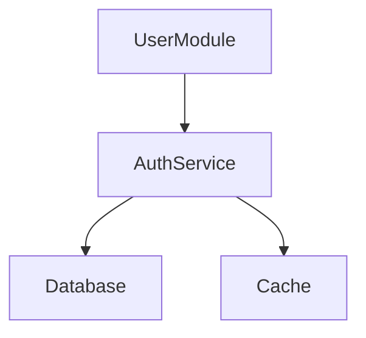

# **GitNexus—代码知识图谱**

## 目录

- [项目介绍](#项目介绍)
  - [🎯 项目概览](#-项目概览)
  - [📝 核心功能](#-核心功能)
  - [🔑 核心特性](#-核心特性)
  - [🚀 工作原理](#-工作原理)
  - [💻 技术栈](#-技术栈)
  - [🎯 关键优势](#-关键优势)
- [GitNexus 在 Cursor、Claude Code 中的安装与使用完整指南](#GitNexus-在-CursorClaude-Code-中的安装与使用完整指南)
  - [📋 前置要求](#-前置要求)
  - [🚀 第一步：全局 MCP 配置（一次性）](#-第一步全局-MCP-配置一次性)
    - [方案 A：自动配置（推荐）](#方案-A自动配置推荐)
    - [方案 B：手动配置](#方案-B手动配置)
      - [对于 Claude Code：](#对于-Claude-Code)
      - [对于 Cursor：](#对于-Cursor)
      - [对于其他 MCP 兼容工具：](#对于其他-MCP-兼容工具)
  - [📦 第二步：索引项目仓库](#-第二步索引项目仓库)
    - [基础索引](#基础索引)
    - [高级选项](#高级选项)
  - [🔗 第三步：编辑器集成与使用](#-第三步编辑器集成与使用)
    - [Claude Code（🌟 完全支持）](#Claude-Code-完全支持)
    - [Cursor（MCP + 技能支持）](#CursorMCP--技能支持)
  - [📊 第四步：常用工作流](#-第四步常用工作流)
    - [场景 1：修复 Bug（推荐用 Claude Code）](#场景-1修复-Bug推荐用-Claude-Code)
    - [场景 2：理解代码结构](#场景-2理解代码结构)
    - [场景 3：代码重构](#场景-3代码重构)
    - [场景 4：启动本地服务器（可视化图谱）](#场景-4启动本地服务器可视化图谱)
  - [🛠️ 完整的 CLI 命令参考](#️-完整的-CLI-命令参考)
  - [⚙️ 索引文件存储位置](#️-索引文件存储位置)
  - [🐛 常见问题排查](#-常见问题排查)
  - [✨ 最佳实践](#-最佳实践)
  - [📚 更多资源](#-更多资源)
- [使用具体的工具和Prompt](#使用具体的工具和Prompt)
  - [🎯 GitNexus 工具详解](#-GitNexus-工具详解)
    - [MCP Prompts（提示词指令）](#MCP-Prompts提示词指令)
      - [1️⃣ gitnexus/detect\_impact - 影响范围分析](#1️⃣-gitnexusdetect_impact---影响范围分析)
      - [2️⃣ gitnexus/generate\_map - 生成架构图](#2️⃣-gitnexusgenerate_map---生成架构图)
    - [Skills（代理技能）](#Skills代理技能)
      - [🛠️ gitnexus-cli - CLI 工具集](#️-gitnexus-cli---CLI-工具集)
      - [🐛 gitnexus-debugging - 调试专家模式](#-gitnexus-debugging---调试专家模式)
      - [🔍 gitnexus-exploring - 代码探索模式](#-gitnexus-exploring---代码探索模式)
  - [📊 快速选择指南](#-快速选择指南)
  - [🎓 实际使用示例](#-实际使用示例)
    - [示例 1：修复登录 Bug](#示例-1修复登录-Bug)
    - [示例 2：安全地重构支付模块](#示例-2安全地重构支付模块)
    - [示例 3：生成项目文档](#示例-3生成项目文档)
  - [💡 最佳实践](#-最佳实践)
  - [⚡ 快速用法小贴士](#-快速用法小贴士)

# 项目介绍

### 🎯 **项目概览**

**GitNexus** 是一个零服务器的代码智能引擎，允许用户在浏览器中运行客户端知识图谱创建工具。这是一个创新的代码分析平台，于 2025 年 8 月 2 日创建。

**项目链接**：[https://github.com/abhigyanpatwari/GitNexus](https://github.com/abhigyanpatwari/GitNexus "https://github.com/abhigyanpatwari/GitNexus") &#x20;

**官网**：[https://gitnexus.vercel.app](https://gitnexus.vercel.app "https://gitnexus.vercel.app")

***

### 📝 **核心功能**

GitNexus 为 AI 代理创建"神经系统"，将任何代码库索引到知识图谱中，追踪：

- **每个依赖关系** - 完整的依赖链
- **调用链** - 函数之间的调用关系
- **代码集群** - 逻辑相关的代码组
- **执行流** - 代码执行路径

通过智能工具向 AI 代理暴露这些信息，使代理永远不会遗漏关键代码关系。

***

### 🔑 **核心特性**

| 特性       | CLI + MCP                         | Web UI                      |
| -------- | --------------------------------- | --------------------------- |
| **用途**​  | 索引本地仓库，通过 MCP 连接 AI 代理            | 可视化图形浏览器 + AI 聊天            |
| **场景**​  | 日常开发（Cursor、Claude Code、Windsurf） | 快速探索、演示、一次性分析               |
| **扩展性**​ | 支持任何大小的完整仓库                       | 浏览器内存限制（\\\~5k 文件），或后端模式无限制 |

***

### 🚀 **工作原理**

1. **索引阶段**：`npx gitnexus analyze` 扫描代码库，构建完整的知识图谱
2. **集成阶段**：自动配置 MCP，集成到编辑器
3. **查询阶段**：AI 代理可以查询图谱，了解代码结构和依赖关系

**支持的编辑器**：

- ✅ **Claude Code** - 完全支持（MCP + 技能 + 自动增强）
- ✅ **Cursor** - MCP + 技能
- ✅ **Windsurf** - MCP
- ✅ **OpenCode** - MCP + 技能
- 以及其他 MCP 兼容工具

***

### 💻 **技术栈**

- **主要语言**：TypeScript

***

***

### 🎯 **关键优势**

1. **完全客户端运行** - 无需服务器，隐私优先
2. **结构化代码理解** - 不仅描述代码，还分析其架构
3. **AI 代理赋能** - 让小模型获得大模型般的理解能力
4. **评估驱动** - 包含 SWE-bench 评估框架，验证改进效果

***

# GitNexus 在 Cursor、Claude Code 中的安装与使用完整指南

## 📋 前置要求

- **Node.js** 18+ 版本
- **npm** 或 **yarn** 包管理器
- **Cursor** 或 **Claude Code** 编辑器
- Git 仓库的完整访问权限

***

## 🚀 第一步：全局 MCP 配置（一次性）

> ⚠️ **重要**：只需执行一次，所有项目通用。

### **方案 A：自动配置（推荐）**

```bash 
npx gitnexus setup
```


这个命令会自动：

- ✅ 检测已安装的编辑器
- ✅ 创建/更新 MCP 配置文件
- ✅ 为 Claude Code 安装技能和钩子
- ✅ 打印完整的配置摘要

### **方案 B：手动配置**

#### **对于 Claude Code：**

```bash 
claude mcp add gitnexus -- npx -y gitnexus@latest mcp
```


#### **对于 Cursor：**

编辑 `~/.cursor/mcp.json`（如不存在则创建）：

```json 
{
  "mcpServers": {
    "gitnexus": {
      "command": "npx",
      "args": ["-y", "gitnexus@latest", "mcp"]
    }
  }
}
```


#### **对于其他 MCP 兼容工具：**

编辑相应配置文件，添加同样的 mcpServers 配置。

***

## 📦 第二步：索引项目仓库

> 💡 **在项目根目录执行**

### **基础索引**

```bash 
# 进入你的项目根目录
cd /path/to/your/project

# 执行索引命令
npx gitnexus analyze
```


这个命令会：

- 🔍 扫描整个代码库
- 🗺️ 构建完整的知识图谱
- 📊 生成调用链、依赖关系、执行流
- 💾 在 `.gitnexus/` 目录存储索引数据
- 📄 生成 `AGENTS.md` 和 `CLAUDE.md` 上下文文件

### **高级选项**

```bash 
# 强制重新索引（忽略缓存）
npx gitnexus analyze --force

# 跳过向量嵌入生成（加快速度）
npx gitnexus analyze --skip-embeddings

# 查看索引状态
npx gitnexus status

# 列出所有已索引的仓库
npx gitnexus list

# 删除当前仓库的索引
npx gitnexus clean
```


***

## 🔗 第三步：编辑器集成与使用

### **Claude Code（🌟 完全支持）**

**支持的功能：**

- ✅ MCP 工具调用
- ✅ 代理技能（Skills）
- ✅ PreToolUse 钩子（自动增强）

**使用流程：**

1. 打开 Claude Code 中的任何文件
2. 启动 AI 会话（使用 Claude Opus 或更高版本）
3. 提问时，AI 代理会自动：
   - 使用 GitNexus 工具查询代码关系
   - 调用 grep/find 时自动增强结果（显示调用者、被调用者）
   - 分析执行流和影响范围（blast radius）

**示例提示词：**

```text 
"帮我修复这个 bug，但要先检查这个函数的所有调用者"
"这个改动会影响哪些其他模块？"
"找出这个文件的完整依赖链"
```


***

### **Cursor（MCP + 技能支持）**

**支持的功能：**

- ✅ MCP 工具调用
- ✅ 代理技能（Skills）
- ❌ 自动钩子增强（需手动指导）

**使用流程：**

1. **打开项目并索引：**
   ```bash 
   npx gitnexus analyze
   ```

2. **在 Cursor 中使用：**
   - 在右侧面板找到 "MCP Servers" 部分
   - 确认 `gitnexus` 已连接（显示绿色 ✓）
   - 在 AI 会话中使用 `@` 符号调用 GitNexus 工具
3. **可用的 MCP 工具：**
   - `find_calls` - 查找函数的所有调用者
   - `find_callers` - 找出调用此函数的地方
   - `analyze_blast_radius` - 分析改动的影响范围
   - `get_execution_flow` - 获取执行流信息

**使用示例：**

```markdown 
使用 @gitnexus 工具找出 deleteUser() 函数的所有调用处
```


***

## 📊 第四步：常用工作流

### **场景 1：修复 Bug（推荐用 Claude Code）**

```markdown 
1. 打开有问题的文件
2. 在 Claude Code 中提问：
   "我在 utils/auth.ts 中发现了一个 bug（描述问题），
    请先用 GitNexus 找出这个函数的所有调用者，
    然后给我修复方案"
3. Claude Code 会自动：
   - 查询知识图谱
   - 列出所有受影响的地方
   - 提供完整的修复方案
```


### **场景 2：理解代码结构**

```text 
1. 在 Cursor 中打开某个文件
2. 右键 → "Ask GitNexus" 或在 AI 聊天中输入：
   "@gitnexus find_calls 'UserService'"
3. 获得完整的依赖关系图
```


### **场景 3：代码重构**

```bash 
# 先更新索引
npx gitnexus analyze

# 在编辑器中提问：
# "我想重构 AuthModule，请给出完整的改动清单（包括所有依赖）"
```


### **场景 4：启动本地服务器（可视化图谱）**

```bash 
# 启动 Web UI 服务器
npx gitnexus serve

# 然后访问浏览器：http://localhost:3000
# 可以可视化整个知识图谱
```


***

## 🛠️ 完整的 CLI 命令参考

```bash 
# 一次性全局设置
npx gitnexus setup                  

# 项目级别（在项目根目录执行）
npx gitnexus analyze [path]         # 索引仓库
npx gitnexus analyze --force        # 强制重新索引
npx gitnexus analyze --skip-embeddings # 跳过嵌入（快速）
npx gitnexus mcp                    # 启动 MCP 服务器（stdio）
npx gitnexus serve                  # 启动 Web 服务器（可视化）
npx gitnexus list                   # 列出已索引仓库
npx gitnexus status                 # 查看索引状态
npx gitnexus clean                  # 删除索引
```


***

## ⚙️ 索引文件存储位置

- **索引数据**：`<项目>/.gitnexus/`
- **Claude Code 技能**：`~/.claude/skills/`
- **Claude Code 钩子**��`~/.claude/hooks/gitnexus/`
- **MCP 配置**（全局）：
  - Cursor: `~/.cursor/mcp.json`
  - OpenCode: `~/.config/opencode/config.json`

***

## 🐛 常见问题排查

| 问题                 | 解决方案                                     |
| ------------------ | ---------------------------------------- |
| MCP 服务器未连接         | 重启编辑器，确保 Node.js 18+ 已安装                 |
| 索引失败               | 运行 \`npx gitnexus analyze --force\` 重新索引 |
| Claude Code 无法调用工具 | 确保运行过 \`npx gitnexus setup\`             |
| 索引文件过大             | 使用 \`--skip-embeddings\` 选项加快速度          |
| Cursor 中看不到 MCP 工具 | 检查 \`\~/.cursor/mcp.json\` 是否正确配置        |

***

## ✨ 最佳实践

1. **首次使用流程**：
   ```bash 
   npx gitnexus setup        # 全局配置（一次性）
   cd your-project
   npx gitnexus analyze      # 索引项目
   # 然后在编辑器中使用
   ```

2. **定期更新索引**：项目有重大更改时重新运行 `npx gitnexus analyze`
3. **优先使用 Claude Code**：获得完整的自动增强功能
4. **利用生成的文档**：查看 `AGENTS.md` 和 `CLAUDE.md` 了解可用工具
5. **可视化图谱**：定期运行 `npx gitnexus serve` 在浏览器中探索代码关系

***

## 📚 更多资源

- **官网**：[https://gitnexus.vercel.app](https://gitnexus.vercel.app "https://gitnexus.vercel.app")
- **GitHub**：[https://github.com/abhigyanpatwari/GitNexus](https://github.com/abhigyanpatwari/GitNexus "https://github.com/abhigyanpatwari/GitNexus")
- **Discord 社区**：[https://discord.gg/AAsRVT6fGb](https://discord.gg/AAsRVT6fGb "https://discord.gg/AAsRVT6fGb")
- **npm 包**：[https://www.npmjs.com/package/gitnexus](https://www.npmjs.com/package/gitnexus "https://www.npmjs.com/package/gitnexus")

# 使用具体的工具和Prompt

## 🎯 GitNexus 工具详解

### **MCP Prompts（提示词指令）**

这些是预设的系统指令，会影响 AI 代理的行为方式。

#### **1️⃣ ****`gitnexus/detect_impact`**** - 影响范围分析**

**用途**：评估代码改动的风险和影响范围

**适用场景**：

- 🔴 修复 Bug 后，要检查会影响哪些其他模块
- 🔄 重构某个函数前，需要了解完整的依赖链
- 🚀 发布新功能前，做风险评估
- 📊 分析代码改动的 "爆炸半径"（blast radius）

**使用示例**：

```markdown 
/gitnexus/detect_impact

修改了 AuthService.validateToken() 这个方法，
请分析这个改动会影响哪些其他地方？
```


**AI 代理会**：

- ✅ 查找所有调用 `validateToken()` 的地方
- ✅ 分析每个调用位置的重要性（critical/high/medium/low）
- ✅ 列出需要修改的其他文件
- ✅ 提醒潜在的风险

***

#### **2️⃣ ****`gitnexus/generate_map`**** - 生成架构图**

**用途**：生成可视化的代码结构和关系图（Mermaid 格式）

**适用场景**：

- 📐 想要可视化模块之间的依赖关系
- 🏗️ 新团队成员快速了解项目架构
- 📝 生成项目文档中的架构图
- 🔍 理解复杂的代码关系

**使用示例**：

```markdown 
/gitnexus/generate_map

请生成一个 Mermaid 图表，显示 UserModule 和相关的所有依赖关系
```


**AI 代理会**：

- ✅ 生成类似这样的 Mermaid 代码：




- ✅ 可以直接在 Cursor 中预览
- ✅ 可以复制到文档中使用

***

### **Skills（代理技能）**

这些是 GitNexus 的具体功能，代理会自动选择使用。

#### **🛠️ ****`gitnexus-cli`**** - CLI 工具集**

**用途**：执行 GitNexus 的具体查询命令

**AI 会自动使用的场景**：

- 当用户要求 "找出这个函数的所有调用者"
- 当用户要求 "分析代码依赖"
- 当用户要求 "列出所有引入这个模块的地方"

**不需要手动选择**，AI 代理会自动判断何时使用

**后台调用的工具包括**：

```bash 
gitnexus find-calls         # 找调用者
gitnexus find-callers       # 找被调用处
gitnexus analyze-blast-radius # 影响范围
gitnexus get-execution-flow   # 执行流
```


***

#### **🐛 ****`gitnexus-debugging`**** - 调试专家模式**

**用途**：帮助你追踪 Bug、理解执行流、分析问题根源

**适用场景**：

- 🐛 你有一个 Bug，需要追踪它的来源
- 🔗 需要理解函数调用链（谁调用了谁）
- 📍 需要找出异常发生的确切位置
- 🔀 理解复杂的控制流逻辑

**使用示例**：

```markdown 
/

然后选择 gitnexus-debugging

我的应用在处理用户登录时会崩溃，
请帮我追踪这个 Bug 的来源
```


**AI 代理会**：

- ✅ 自动查询代码库中的登录流程
- ✅ 列出所有相关的调用链
- ✅ 找出可能的异常发生点
- ✅ 提供修复建议

***

#### **🔍 ****`gitnexus-exploring`**** - 代码探索模式**

**用途**：帮助你理解和探索代码库结构

**适用场景**：

- 📚 新加入项目，需要快速理解代码结构
- 🗺️ 想要了解某个模块的完整功能
- 🔎 探索代码库如何组织的
- 💡 学习现有的设计模式和架构

**使用示例**：

```markdown 
/

然后选择 gitnexus-exploring

请帮我理解 UserService 模块的完整功能和它如何与其他部分集成
```


**AI 代理会**：

- ✅ 分析 UserService 的所有公共方法
- ✅ 列出它的所有依赖
- ✅ 展示其他模块如何使用它
- ✅ 总结这个模块的架构角色

***

## 📊 快速选择指南

| 你的需求        | 选择方案                                           |
| ----------- | ---------------------------------------------- |
| **修复 Bug**​ | \`gitnexus-debugging\`                         |
| **评估改动风险**​ | \`gitnexus/detect\_impact\`                    |
| **生成架构图**​  | \`gitnexus/generate\_map\`                     |
| **理解代码结构**​ | \`gitnexus-exploring\`                         |
| **重构代码**​   | \`gitnexus/detect\_impact\` + \`gitnexus-cli\` |
| **新人学习项目**​ | \`gitnexus-exploring\`                         |

***

## 🎓 实际使用示例

### **示例 1：修复登录 Bug**

```markdown 
输入 /，选择 gitnexus-debugging

我在 AuthController.login() 中发现请求总是返回 401，
请追踪这个问题的来源
```


**代理会**：

- 查询 AuthController.login() 的完整执行流
- 检查它调用了哪些函数
- 找出可能的错误点
- 提供修复方案

***

### **示例 2：安全地重构支付模块**

```markdown 
输入 /，选择 gitnexus/detect_impact

我想重构 PaymentService，请先分析这个改动的影响范围
```


**代理会**：

- 列出所有使用 PaymentService 的地方
- 标记哪些是 critical（关键）
- 提醒需要更新的其他模块
- 给出安全的重构步骤

***

### **示例 3：生成项目文档**

```markdown 
输入 /，选择 gitnexus/generate_map

请生成一个图表显示数据库层、业务逻辑层、API 层之间的关系
```


**代理会**：

- 生成 Mermaid 格式的架构图
- 你可以直接复制到 README 或文档中

***

## 💡 最佳实践

1. **日常开发**：
   - 修改代码前 → 用 `gitnexus/detect_impact`
   - 遇到 Bug → 用 `gitnexus-debugging`
2. **新人入职**：
   - 第一天 → 用 `gitnexus-exploring` 理解项目
   - 然后 → 根据具体任务选择其他工具
3. **重大重构**：
   - 先用 `gitnexus/generate_map` 理解现有结构
   - 再用 `gitnexus/detect_impact` 评估风险
   - 最后用 `gitnexus-debugging` 验证改动
4. **代码审查**：
   - 用 `gitnexus/detect_impact` 检查 PR 的影响范围

***

## ⚡ 快速用法小贴士

你可以**不输入 ****`/`**** 直接提问**，AI 代理会自动选择合适的工具：

```markdown 
"这个改动会影响哪些地方？"
→ 自动使用 gitnexus/detect_impact

"帮我追踪这个 Bug"
→ 自动使用 gitnexus-debugging

"生成一个架构图"
→ 自动使用 gitnexus/generate_map

"新项目成员应该如何理解这个模块？"
→ 自动使用 gitnexus-exploring
```


***
